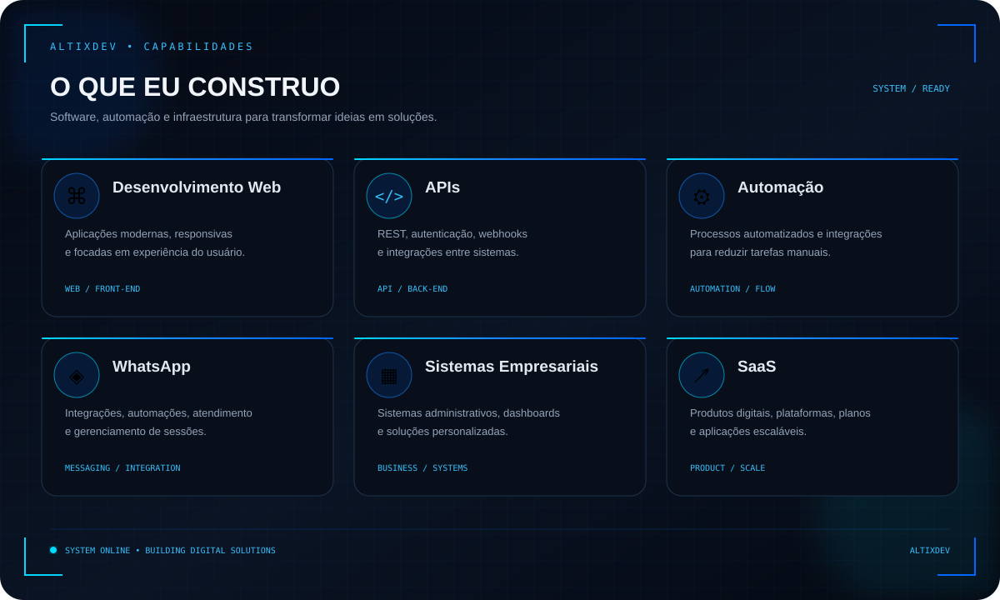

<div align="center">


<br>

### `IDEIA` → `CÓDIGO` → `BUILD` → `DEPLOY` → `ESCALA`

</div>

---

# ⚡ Sobre mim

Sou **Software Engineer e Full Stack Developer**, focado na criação de sistemas, APIs, automações, integrações e produtos digitais.

Gosto de transformar problemas reais em soluções de software modernas, funcionais e escaláveis.

Atuo desde a construção da interface até a arquitetura do back-end, banco de dados, infraestrutura e deploy.

> **Meu objetivo não é apenas escrever código.**
>
> **É transformar ideias em soluções que funcionam na prática.**

---

# 🧠 O que eu construo

<div align="center">



</div>

---

# 💻 Tecnologias

## Front-end

<div align="center">


</div>

---

## Back-end

<div align="center">


</div>

---

## Banco de Dados

<div align="center">


</div>

---

## DevOps & Infraestrutura

<div align="center">


</div>

---

# 🧬 Development Pulse

<div align="center">


<br>

<sub>
Atualizado automaticamente pelo GitHub Actions com base na atividade de desenvolvimento do mês atual.
</sub>

</div>

---

# 🧠 Especialidades

<table>
<tr>

<td width="33%" valign="top">

## 🌐 Desenvolvimento Web

- Interfaces modernas
- Landing pages
- Dashboards
- Sistemas administrativos
- Aplicações SaaS
- Aplicações React
- Aplicações Vite
- Integração Front-end + Back-end

</td>

<td width="33%" valign="top">

## 🔌 APIs

- REST APIs
- APIs em Node.js
- APIs em Go
- Autenticação
- JWT
- Webhooks
- Rate limiting
- Integração com bancos
- Integração entre sistemas

</td>

<td width="33%" valign="top">

## 🤖 Automação

- Automação de processos
- Integrações
- Webhooks
- Processamento de dados
- Automação de atendimento
- Fluxos automatizados
- APIs externas

</td>

</tr>

<tr>

<td width="33%" valign="top">

## 📱 Integrações com WhatsApp

- APIs de WhatsApp
- Gerenciamento de sessões
- Mensagens automatizadas
- Webhooks
- Integrações
- Sistemas de atendimento
- Automação de processos

</td>

<td width="33%" valign="top">

## 🏢 Sistemas Empresariais

- Painéis administrativos
- Gestão de usuários
- Controle de acesso
- Sistemas internos
- Dashboards
- Gestão de dados
- Integrações empresariais

</td>

<td width="33%" valign="top">

## 🚀 SaaS

- Multiusuário
- Multi-tenant
- Planos
- Controle de acesso
- Autenticação
- APIs
- Dashboards
- Integrações de pagamento
- Monitoramento

</td>

</tr>
</table>

---

# 🔥 Projetos

<table>
<tr>

<td width="50%" valign="top">

## 🔵 AltixDev

### Desenvolvimento de Software & Soluções Digitais

A **AltixDev** é minha marca voltada para desenvolvimento de software e criação de soluções digitais.

**Áreas de atuação:**

- Desenvolvimento de sistemas
- Aplicações web
- APIs
- Automação
- Integrações
- Soluções personalizadas
- Produtos digitais
- SaaS

<br>

<a href="https://altixdev.com.br">


</a>

</td>

<td width="50%" valign="top">

## 💻 Wesley Barroso

### Software Engineer & Full Stack Developer

Meu portfólio pessoal reúne projetos, experiências, tecnologias e trabalhos relacionados ao desenvolvimento de software.

**Conteúdos:**

- Portfólio
- Projetos
- Tecnologias
- Experiências
- Trabalhos
- Desenvolvimento

<br>

<a href="https://wesleybarroso.com">


</a>

</td>

</tr>
</table>

---

# 🛠️ Stack

<div align="center">

| Camada | Tecnologias |
|:---:|:---|
| 🌐 Front-end | React · TypeScript · JavaScript · Vite · Next.js · HTML · CSS |
| ⚙️ Back-end | Node.js · Go · Express · Fastify · Python |
| 🔌 APIs | REST · JWT · Webhooks · Rate Limiting · Integrações |
| 🗄️ Database | PostgreSQL · MySQL · SQLite · Redis |
| 🐳 Infraestrutura | Docker · Linux · Nginx · Traefik |
| 🔧 Versionamento | Git · GitHub |
| 🚀 Produto | SaaS · Sistemas · Automação |

</div>

---

# 🏗️ Arquitetura

Gosto de construir aplicações pensando em organização, manutenção, segurança e crescimento.

```text
                         ┌──────────────────┐
                         │     FRONT-END    │
                         │   React / Vite   │
                         └────────┬─────────┘
                                  │
                                  ▼
                         ┌──────────────────┐
                         │       API        │
                         │   Node.js / Go   │
                         └────────┬─────────┘
                                  │
              ┌───────────────────┼───────────────────┐
              │                   │                   │
              ▼                   ▼                   ▼
       ┌─────────────┐     ┌─────────────┐     ┌─────────────┐
       │ PostgreSQL  │     │    Redis    │     │  Serviços   │
       └─────────────┘     └─────────────┘     └─────────────┘
              │                   │                   │
              └───────────────────┼───────────────────┘
                                  │
                                  ▼
                         ┌──────────────────┐
                         │      DOCKER      │
                         │  INFRAESTRUTURA  │
                         └──────────────────┘
```

---

# ⚙️ Como trabalho

<div align="center">



</div>

---

# 🎯 Atualmente

Estou focado em construir soluções que unam **software, automação, integrações e infraestrutura**.

### 🚀 Desenvolvimento

- Criar produtos digitais
- Desenvolver sistemas completos
- Criar aplicações web modernas
- Desenvolver APIs escaláveis
- Construir aplicações SaaS

### 🤖 Automação & Integrações

- Automatizar processos
- Desenvolver integrações com WhatsApp
- Criar fluxos automatizados
- Integrar APIs externas
- Desenvolver sistemas de atendimento

### ☁️ Infraestrutura

- Melhorar ambientes de produção
- Trabalhar com Docker
- Automatizar deploys
- Melhorar arquitetura
- Criar ambientes escaláveis

### 🧠 Engenharia de Software

- Aprimorar arquitetura de software
- Criar sistemas mais seguros
- Melhorar performance
- Trabalhar com microsserviços
- Desenvolver soluções orientadas a dados

---

# 🌎 Ecossistema

<div align="center">

## 🔵 AltixDev

**Desenvolvimento de software e soluções digitais**

<br>

<a href="https://altixdev.com.br">


</a>

<br><br>

## 💻 Wesley Barroso

**Portfólio pessoal, projetos e experiências**

<br>

<a href="https://wesleybarroso.com">


</a>

</div>

---

# 📌 Áreas de atuação

<div align="center">

| Área | Foco |
|---|---|
| 🌐 Web | Aplicações modernas e responsivas |
| 🔌 APIs | Integrações e sistemas |
| 🤖 Automação | Processos automatizados |
| 📱 WhatsApp | Comunicação e automação |
| 🏢 Empresarial | Sistemas personalizados |
| 🚀 SaaS | Produtos digitais |
| 🐳 DevOps | Containers e infraestrutura |
| 🗄️ Dados | Bancos e processamento |

</div>

---

# 🌎 Conecte-se comigo

<div align="center">

<a href="https://wesleybarroso.com">


</a>

&nbsp;&nbsp;

<a href="https://altixdev.com.br">


</a>

&nbsp;&nbsp;

<a href="https://github.com/Wesleybarroso">


</a>

&nbsp;&nbsp;

<a href="https://instagram.com/wesley.lte">


</a>

</div>

---

# 💙 Filosofia

<div align="center">

### `CÓDIGO É UMA FERRAMENTA.`

### `O OBJETIVO É CRIAR SOLUÇÕES.`

<br>

> **Transformar ideias em software.**
>
> **Transformar problemas em soluções.**
>
> **Transformar código em produtos.**

</div>

---

<div align="center">


<br>

### 🚀 TRANSFORMANDO IDEIAS EM SOFTWARE.

**Wesley Barroso**

`Software Engineer` • `Full Stack Developer`

<br>

<a href="https://github.com/Wesleybarroso">


</a>

</div>
