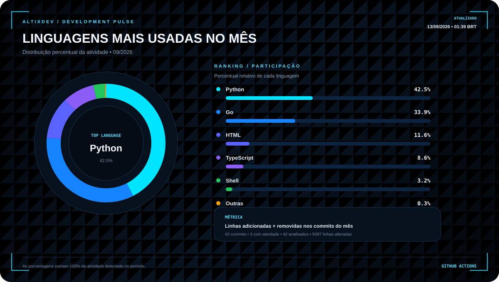

<div align="center">



<br>

### `IDEIA` → `CÓDIGO` → `BUILD` → `DEPLOY` → `ESCALA`

</div>

---

# ⚡ Sobre mim

Sou **Software Engineer e Full Stack Developer**, focado na criação de sistemas, APIs, automações, integrações e produtos digitais.

Gosto de transformar problemas reais em soluções de software modernas, funcionais e escaláveis.

Atuo desde a construção da interface até a arquitetura do back-end, banco de dados, infraestrutura e deploy.

> **Meu objetivo não é apenas escrever código.**
>
> **É transformar ideias em soluções que funcionam na prática.**

---

# 🧠 O que eu construo

<table>
<tr>

<td width="33%" align="center">

## 🌐 Desenvolvimento Web

Aplicações modernas, responsivas e orientadas à experiência do usuário.

</td>

<td width="33%" align="center">

## 🔌 APIs

APIs REST, integrações, autenticação, webhooks e sistemas distribuídos.

</td>

<td width="33%" align="center">

## 🤖 Automação

Automação de processos e integração entre diferentes sistemas.

</td>

</tr>

<tr>

<td width="33%" align="center">

## 📱 WhatsApp

Integrações, automações, atendimento e gerenciamento de sessões.

</td>

<td width="33%" align="center">

## 🏢 Sistemas Empresariais

Sistemas administrativos, dashboards e soluções personalizadas.

</td>

<td width="33%" align="center">

## 🚀 SaaS

Produtos digitais, plataformas, planos, usuários e escalabilidade.

</td>

</tr>
</table>

---

# 💻 Tecnologias

## Front-end

<div align="center">


</div>

---

## Back-end

<div align="center">


</div>

---

## Banco de Dados

<div align="center">


</div>

---

## DevOps & Infraestrutura

<div align="center">


</div>

---

# 🧬 Development Pulse

<div align="center">



<br>

<sub>
Atualizado automaticamente todos os dias pelo GitHub Actions com base nos commits e arquivos alterados no mês atual.
</sub>

</div>

---

# 🧠 Especialidades

<table>

<tr>

<td width="33%" valign="top">

## 🌐 Desenvolvimento Web

- Interfaces modernas
- Landing pages
- Dashboards
- Sistemas administrativos
- Aplicações SaaS
- Aplicações React
- Aplicações Vite
- Integração Front-end + Back-end

</td>

<td width="33%" valign="top">

## 🔌 APIs

- REST APIs
- APIs em Node.js
- APIs em Go
- Autenticação
- JWT
- Webhooks
- Rate limiting
- Integração com bancos
- Integração entre sistemas

</td>

<td width="33%" valign="top">

## 🤖 Automação

- Automação de processos
- Integrações
- Webhooks
- Processamento de dados
- Automação de atendimento
- Fluxos automatizados
- APIs externas

</td>

</tr>

<tr>

<td width="33%" valign="top">

## 📱 Integrações com WhatsApp

- APIs de WhatsApp
- Gerenciamento de sessões
- Mensagens automatizadas
- Webhooks
- Integrações
- Sistemas de atendimento
- Automação de processos

</td>

<td width="33%" valign="top">

## 🏢 Sistemas Empresariais

- Painéis administrativos
- Gestão de usuários
- Controle de acesso
- Sistemas internos
- Dashboards
- Gestão de dados
- Integrações empresariais

</td>

<td width="33%" valign="top">

## 🚀 SaaS

- Multiusuário
- Multi-tenant
- Planos
- Controle de acesso
- Autenticação
- APIs
- Dashboards
- Integrações de pagamento
- Monitoramento

</td>

</tr>

</table>

---

# 🔥 Projetos

<table>

<tr>

<td width="50%" valign="top">

## 🔵 AltixDev

### Desenvolvimento de Software & Soluções Digitais

A **AltixDev** é minha marca voltada para desenvolvimento de software e criação de soluções digitais.

### Áreas de atuação

- Desenvolvimento de sistemas
- Aplicações web
- APIs
- Automação
- Integrações
- Soluções personalizadas
- Produtos digitais
- SaaS

<br>

<a href="https://altixdev.com.br">


</a>

</td>

<td width="50%" valign="top">

## 💻 Wesley Barroso

### Software Engineer & Full Stack Developer

Meu portfólio pessoal reúne projetos, experiências, tecnologias e trabalhos relacionados ao desenvolvimento de software.

### Conteúdos

- Portfólio
- Projetos
- Tecnologias
- Experiências
- Trabalhos
- Desenvolvimento

<br>

<a href="https://wesleybarroso.com">


</a>

</td>

</tr>

</table>

---

# 🛠️ Stack

```text
┌─────────────────────────────────────────────────────────┐
│                      FRONT-END                          │
├─────────────────────────────────────────────────────────┤
│ React • TypeScript • JavaScript • Vite • HTML • CSS    │
│ Next.js                                                 │
└─────────────────────────────────────────────────────────┘

┌─────────────────────────────────────────────────────────┐
│                       BACK-END                          │
├─────────────────────────────────────────────────────────┤
│ Node.js • Go • Express • Fastify • Python • REST APIs │
└─────────────────────────────────────────────────────────┘

┌─────────────────────────────────────────────────────────┐
│                       DATABASE                          │
├─────────────────────────────────────────────────────────┤
│ PostgreSQL • MySQL • SQLite • Redis                   │
└─────────────────────────────────────────────────────────┘

┌─────────────────────────────────────────────────────────┐
│                    INFRASTRUCTURE                       │
├─────────────────────────────────────────────────────────┤
│ Docker • Linux • Nginx • Traefik • Git • GitHub       │
└─────────────────────────────────────────────────────────┘
```

---

# 🏗️ Arquitetura

Gosto de construir aplicações pensando em organização, manutenção, segurança e crescimento.

```text
                         ┌──────────────────┐
                         │     FRONT-END    │
                         │   React / Vite   │
                         └────────┬─────────┘
                                  │
                                  ▼
                         ┌──────────────────┐
                         │       API        │
                         │   Node.js / Go   │
                         └────────┬─────────┘
                                  │
              ┌───────────────────┼───────────────────┐
              │                   │                   │
              ▼                   ▼                   ▼
       ┌─────────────┐     ┌─────────────┐     ┌─────────────┐
       │ PostgreSQL  │     │    Redis    │     │  Serviços   │
       └─────────────┘     └─────────────┘     └─────────────┘
              │                   │                   │
              └───────────────────┼───────────────────┘
                                  │
                                  ▼
                         ┌──────────────────┐
                         │      DOCKER      │
                         │  INFRAESTRUTURA  │
                         └──────────────────┘
```

---

# ⚙️ Como trabalho

<table>

<tr>

<td align="center" width="16%">

### 01

🧠

**ENTENDIMENTO**

Problema, objetivos e necessidades.

</td>

<td align="center" width="16%">

### 02

📐

**PLANEJAMENTO**

Funcionalidades, arquitetura e tecnologias.

</td>

<td align="center" width="16%">

### 03

💻

**DESENVOLVIMENTO**

Código organizado e boas práticas.

</td>

<td align="center" width="16%">

### 04

🧪

**TESTES**

Funcionalidades e integrações.

</td>

<td align="center" width="16%">

### 05

🚀

**DEPLOY**

Aplicação preparada para produção.

</td>

<td align="center" width="16%">

### 06

📈

**EVOLUÇÃO**

Melhorias e novas funcionalidades.

</td>

</tr>

</table>

---

# 🔄 Ciclo de desenvolvimento

<div align="center">

`💡 IDEIA`

↓

`🧠 ANÁLISE`

↓

`📐 DESIGN`

↓

`💻 CÓDIGO`

↓

`🧪 TESTES`

↓

`🚀 DEPLOY`

↓

`📈 ESCALA`

</div>

---

# ⚡ Painel do Desenvolvedor

<div align="center">

| Área | Foco |
|---|---|
| 🌐 Front-end | React · TypeScript · JavaScript · Vite |
| ⚙️ Back-end | Node.js · Go · Express · Fastify |
| 🔌 APIs | REST · JWT · Webhooks · Integrações |
| 🗄️ Dados | PostgreSQL · MySQL · SQLite · Redis |
| 🐳 Infraestrutura | Docker · Linux · Nginx · Traefik |
| 🔧 Versionamento | Git · GitHub |
| 🚀 Produto | SaaS · Sistemas · Automação |

</div>

---

# 🎯 Atualmente

Estou focado em:

- 🚀 Criar produtos digitais
- 💻 Desenvolver sistemas completos
- 🔌 Criar APIs escaláveis
- 🤖 Automatizar processos
- 📱 Desenvolver integrações com WhatsApp
- 🏢 Criar soluções para empresas
- ☁️ Melhorar infraestrutura e deploy
- 🧠 Aprimorar arquitetura de software
- 🔐 Desenvolver aplicações seguras
- 📊 Criar sistemas orientados a dados

---

# 🌎 Ecossistema

<div align="center">

## 🔵 AltixDev

**Desenvolvimento de software e soluções digitais**

<br>

<a href="https://altixdev.com.br">


</a>

<br><br>

## 💻 Wesley Barroso

**Portfólio pessoal e projetos**

<br>

<a href="https://wesleybarroso.com">


</a>

</div>

---

# 💙 Filosofia

<div align="center">

### `CÓDIGO É UMA FERRAMENTA.`

### `O OBJETIVO É CRIAR SOLUÇÕES.`

<br>

> **Transformar ideias em software.**
>
> **Transformar problemas em soluções.**
>
> **Transformar código em produtos.**

</div>

---

<div align="center">


### 🚀 TRANSFORMANDO IDEIAS EM SOFTWARE.

**Wesley Barroso**

`Software Engineer` • `Full Stack Developer`

<br>

<a href="https://github.com/Wesleybarroso">


</a>

</div>
